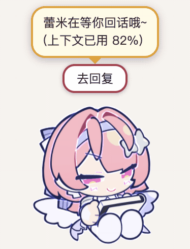

# RemiPet 🦇

一个实时盯着 **Claude Code** 的桌宠:它会随 agent 的状态换动作(酝酿 / 动笔 / 翻资料 / 等你授权 / 完工 / 出错),把回复摘要弹成气泡,在上下文吃紧时预警,并在托盘里给出今日 token 用量与花费。需要授权时可以**直接在桌宠上一键批准或拒绝**,不用切回终端。

> ⚠️ **随缘更新**。自用的小玩意儿,想到什么加什么,没有路线图、没有版本承诺、不保证向后兼容。issue 和 PR 看到了会看,但不保证响应速度——你 fork 走自己改可能更快。

> ⚠️ **本仓库只有代码,不含美术素材,也不提供预构建安装包。** 角色形象与 Spine 素材的权利都不属于本项目,你需要自备素材;不提供安装包的原因见 [许可与素材权利](#许可与素材权利-)。

<p align="center">
  
  
  
</p>
<p align="center"><sub>左:一轮任务里的状态流转 · 中:一键批准权限 · 右:等你回话 + 「去回复」</sub></p>

## 状态 × 动作

| 动作 | 状态 | 什么时候出现 |
|---|---|---|
|  | ✍️ **thinking 酝酿** | 收到你的提示词,正在想怎么写——执笔悬在纸上不动 |
|  | ⚡️ **working 动手** | Bash / Edit / Write 等输出类工具——挥笔狂写还冒汗 |
|  | 📖 **working 翻资料** | Read / Grep / Glob / Web 等阅读类工具——低头边看边记 |
|  | 🖐 **waiting 等你** | 等你批准权限,或等你回话——安静看书,靠气泡和按钮提醒 |
|  | 🎉 **done 完工** | 一轮任务干完,气泡附上回复摘要——把成品凑到脸前陶醉 |
|  | 💥 **error 出错** | 工具失败或 API 报错,气泡转红并标出错误类型 |
|  | 🧹 **compacting 整理记忆** | 压缩上下文时 |
|  | 💗 **被夸 / 被谢** | 提示词里夸她或谢她——执笔抵着嘴角偷笑 |
|  | 😴 **sleeping 休息** | 会话结束,或空闲 10 分钟——自己静静看书,不弹气泡 |

多个 Claude 会话同时跑时按优先级(出错 > 等授权 > 干活 > 酝酿)展示,气泡带 `[项目名]` 前缀。托盘菜单里还有:今日用量、尺寸调节、开机自启、完整演示(一次过完所有状态)。全程本地,不联网。

## 它怎么接进 Claude Code

装的时候往 `~/.claude/settings.json` 注册两类 hook(**合并写入,不动你已有的 hook**,首次改动前先备份):

- **命令 hook**(11 个生命周期事件):`SessionStart / UserPromptSubmit / PreToolUse / PostToolUse / SubagentStop / Stop / StopFailure / Notification / PreCompact / PostCompact / SessionEnd` 触发 `hook/remi-hook.js`,它读 stdin 和 transcript 尾巴,POST 一个状态包给本地 server(`127.0.0.1:41560` 起)。
- **PermissionRequest HTTP hook(阻塞式)**:Claude Code 要权限时 POST `/permission` 并挂起连接,等桌宠回 `allow` / `deny`。

安全兜底有三层,任何一层都不会卡住 Claude Code:

1. 桌宠没在跑 → 连接直接失败,Claude Code 回落到它自己的终端提示;
2. 8 分钟没人点 → 自动放行回终端(早于 Claude Code 自己的 hook 超时);
3. 你在终端先答了 → Claude Code 断开挂起的连接,卡片自动撤销。

同一请求被重发时会合并到同一张卡片,一次点击答复所有副本。`TaskCreate` 这类纯编排工具自动放行,`AskUserQuestion` 交还终端(选项交互在终端里体验更好)。

## 准备素材

本仓库不含素材,首次使用需要自备一套 **Spine 4.2** 导出的骨骼动画:

```bash
# 1. 把素材放进 assets/spine/(骨架 .json + .atlas + 贴图 .png)
#    默认文件名 remi.json / leimi.atlas / leimi.png,不一致可用环境变量覆盖:
#    REMI_SKEL=xx.json REMI_ATLAS=xx.atlas REMI_PNG=xx.png
npm run gen-assets     # 打包成 data URI → renderer/spine-data.js

# 2. 确认动画名与状态映射对得上
npx electron scripts/frames-main.js   # 逐动画拆 8 帧成动作条 → /tmp/remi_frames/
#    看清每个动画在干什么后,改 shared/states.js 里的 STATE_ANIM

# 3. 生成图标(可选,打包用)
npm run gen-icon
```

状态映射、气泡台词、工具名中文映射全都集中在 `shared/states.js`,换素材后主要改那一个文件。

## 运行

**前置**:macOS(arm64 实测)、Node.js ≥ 18、装过并用过 [Claude Code](https://claude.com/claude-code)。

```bash
npm install
npm run install-hook   # 注册 hook(合并写入,首次自动备份 settings.json)
npm start              # 启动桌宠
npm run uninstall-hook # 移除 hook
```

打包成 macOS .app(自用):

```bash
npm run build:mac                                   # → dist/mac-arm64/RemiPet.app
cp -R dist/mac-arm64/RemiPet.app ~/Applications/
```

- **拖拽**宠物本体移动位置(自动记忆);菜单栏图标里可调尺寸、勾选开机自启、跑完整演示、退出。
- hook 对**新开的** `claude` 会话生效;已开着的会话需重启。
- 打包后 hook 脚本必须在 asar 之外(Claude Code 用系统 node 直接执行它),靠 `build.extraResources` 复制到 `Contents/Resources/pet-hook/`;app 启动时会自愈 hook 路径,所以从源码切到 .app、或把 .app 挪了位置都不用手动重装。

## 架构

```
Claude Code hooks(11 个生命周期事件 + PermissionRequest 阻塞式 HTTP hook)
  └─ hook/remi-hook.js      stdin JSON → 状态,POST /state(<600ms 必退出)
       └─ backend/server.js  127.0.0.1:41560-41564,响应头 x-remi-pet 识别自家服务
            ├─ core.js        按 session 聚合 + 优先级 + TTL 回落
            ├─ permission.js  挂起 CC 连接等你点按钮,超时/断连自动放行终端
            ├─ transcript.js  读 transcript 尾部:回复摘要 / 上下文占用 / API 错误
            ├─ metering.js    增量扫 ~/.claude/projects 算 token 与费用
            └─ focus.js       「去回复」按 tty 精确聚焦会话所在终端标签页
                 └─ renderer/pet.js   spine-player 切动画 + 气泡 + 按钮

shared/states.js   状态词表、优先级、动画映射、台词的唯一事实源
```

## 风险与权衡(已知)

| 项 | 说明 | 现状 / 缓解 |
|---|---|---|
| **本地 `/permission` 伪造** | 任何本机进程都能 POST `/permission`,弹一张假的授权卡片 | 只绑 `127.0.0.1`;点「批准」只是把决定回给持连接的那一方,**不能让 Claude 执行任何东西**;属社工风险 |
| **本地 `/state` 伪造** | 本机进程可以驱动动画和假气泡 | 纯装饰性,localhost-only |
| **hook 残留** | 卸了桌宠但没卸 hook,Claude Code 每个事件仍会 spawn 一次 node | 连不上就静默退出(~150ms),影响极小;托盘可一键卸载,备份可回滚 |
| **定价是估算** | 内置单价按公开价目表写死,未区分长上下文变体等情形 | 用 `~/.remi-pet/pricing.json` 覆盖 |
| **读 transcript** | 会读 `~/.claude` 下的会话记录 | 只在本机读,只取 token 数 / 模型 / 时间戳 / 最后一段回复摘要,**不外传** |
| **回复摘要未做密钥脱敏** | 完工气泡显示最后一段 assistant 文本(截断 60 字),若回复里恰好有密钥会显示出来 | 只出现在你自己屏幕上;不想要可把 `backend/core.js` 里 `SNIPPET_BUBBLE_MAX` 改成 0 |
| **「去回复」平台覆盖** | 只有 macOS 实测可用;Terminal.app / iTerm2 能按 tty 精确到标签页,其他终端只能聚焦到应用 | Windows / niri 的适配接口已留好,未实现 |
| **计量去重边界** | 流式写入的重复行如果跨两次扫描被切开,理论上有极小概率重复计数 | 同文件内按 `message.id` 去重;概率极低 |
| **Electron 体积** | 打包后 ~250MB | 未做瘦身 |

### 安全上做了什么

- HTTP 只绑 `127.0.0.1`;body 有上限(`/state` 64KB、`/permission` 256KB);字段逐个校验 + 状态白名单。
- 配置、用量、`settings.json` 全部**原子写**(tmp + rename);hook 安装**合并不覆盖**,只碰 command 含 `remi-hook.js` 或 url 指向本机 `/permission` 的条目,首次改动前备份。
- Electron:`contextIsolation` 开、`nodeIntegration` 关,preload 只暴露三个方法(ready / decide / focus)。
- 回复摘要做了长度截断和控制字符清洗。
- 权限决定只回给持连接的那一方;超时或断连一律走「不作答」,让 Claude Code 回到终端提示。

## 未做 / 后续

- 只支持 **Claude Code**,不打算适配别的 agent。
- Windows / Linux(niri)的「去回复」窗口聚焦。
- 远程审批、自动更新、Electron 瘦身:没有计划。

## 数据文件

| 路径 | 内容 |
|---|---|
| `~/.remi-pet/config.json` | 窗口位置、尺寸 |
| `~/.remi-pet/runtime.json` | 运行时端口(退出时清除) |
| `~/.remi-pet/usage.json` | token 用量聚合(按天,保留 60 天) |
| `~/.remi-pet/pricing.json` | 可选,覆盖内置模型价格表 |
| `~/.claude/settings.json.remi-backup` | 首次安装 hook 前的备份 |

## 许可与素材权利 ⚠️

**代码**:MIT(见 `LICENSE`)。

**不提供预构建安装包**,只开源代码——原因是下面两条,不是懒。自己 clone、自备素材、本地构建自用不受影响。

**素材**:不在本仓库内。使用者自备,并自行确保拥有相应授权。几种常见情形:

- 角色形象属于某商业 IP → 遵守该 IP 方的二次创作规约(通常限非商业使用)。
- Spine 骨骼工程由他人制作 → 再分发需要该作者授权;很多同人素材明确禁止二次分发。
- **素材是从游戏客户端 / 官方资源里提取的** → 权利属于游戏公司。二创规约一般允许**你自己创作**的同人,但基本都禁止直接使用与分发**游戏内美术资产**。转载者写的「仅供学习使用」并不构成授权——他们通常不是权利人。

自己本地跑一个桌宠自娱,和把素材打包分发出去,是完全不同的两件事。本仓库的演示 GIF 属于运行效果展示(性质接近游戏截图),不含可复用的素材文件。

**Spine Runtimes**:本项目用 `@esotericsoftware/spine-player` 渲染骨骼动画,其许可**不是** MIT。Spine Runtimes License Agreement 要求**每一位使用者自行持有有效的 Spine Editor 许可证**,且任何形式的再分发都必须附带该许可与版权声明。这是本项目不提供安装包的直接原因。详见 `THIRD-PARTY-NOTICES.md`。

灵感来自 [LLMPET](https://github.com/myunwang/LLMPET)——研究了它接入 Claude Code hook 的机制,本仓库代码为独立实现。
